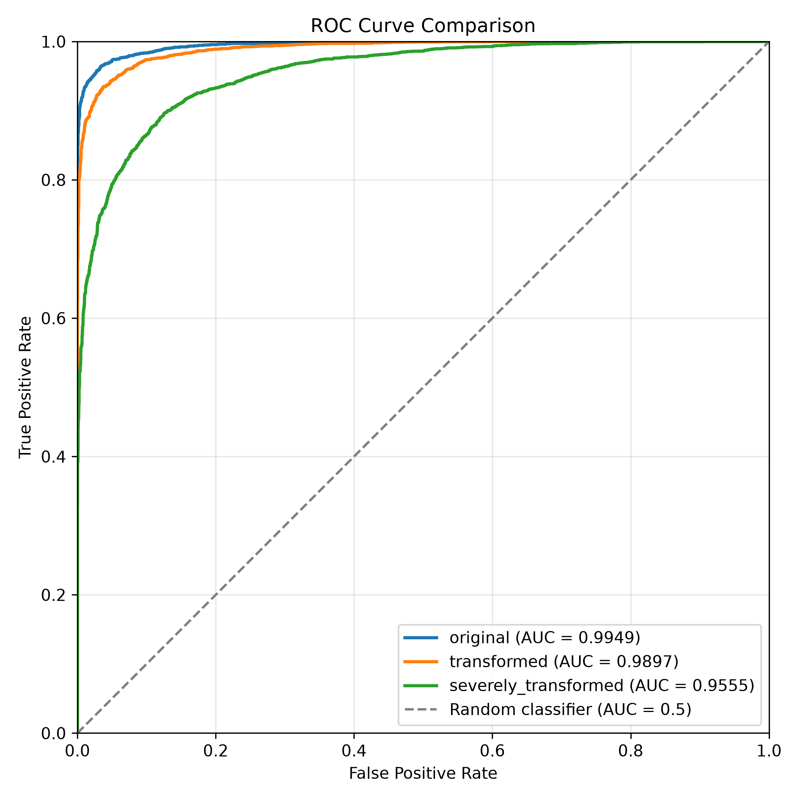
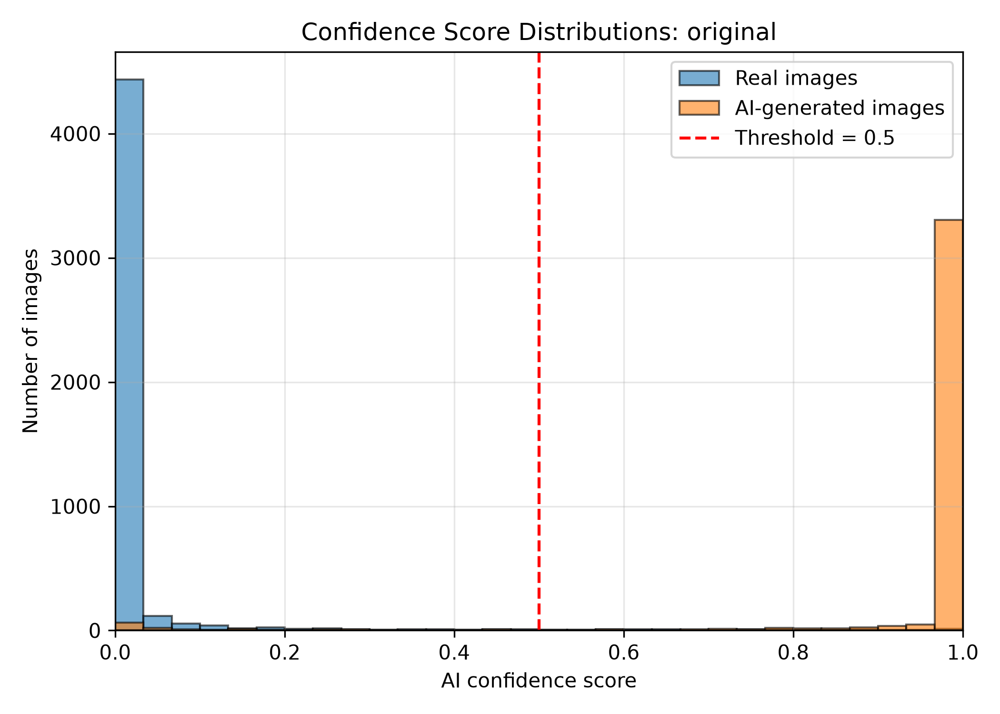
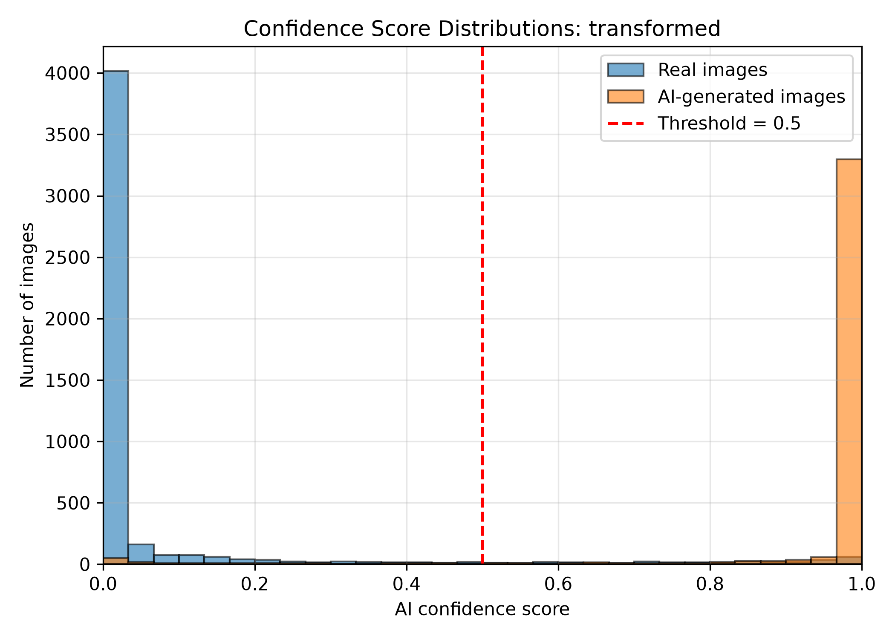
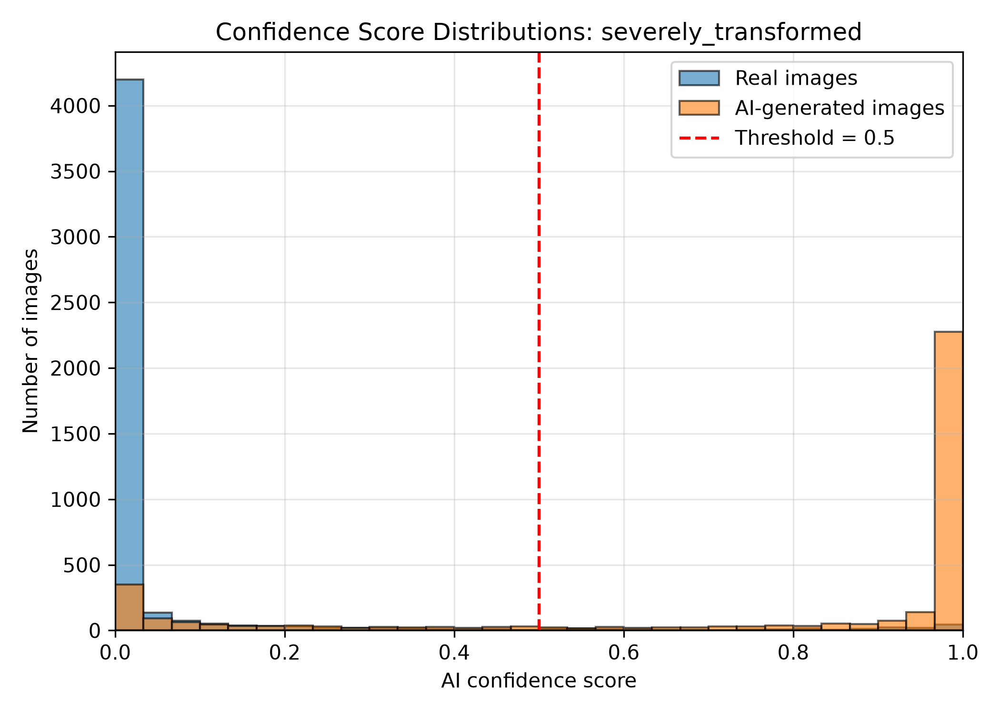

# Robust Detection of AI‑Generated Images Under Real‑World Transformations
## Project Overview
This project implements a deep learning‑based detector that distinguishes AI‑generated images from authentic photographs, 
with a focus on robustness to common real‑world transformations such as JPEG compression, blur, resizing, noise, color adjustments, cropping and rotation.
The solution uses a lightweight convolutional neural network (ConvNeXt_Small) fused with radially averaged spectral cues, fine‑tuned on public datasets (saberzl/SID_Set, OwensLab/CommunityForensics), together with an augmentation pipeline during training to simulate the post‑processing artifacts often encountered when images are shared on social media or messaging platforms. Furthermore, methods from [Spectral Tail Auxiliary Learning](https://arxiv.org/html/2605.22751v1) and [Any-Resolution AI-Generated Image Detection by Spectral Learning](https://arxiv.org/html/2411.19417v2) are explored.
## Results and Robustness Evaluation Summary
The zip files ``demo_data/clean_demo.7z``, ``demo_data/transformed_demo.7z``, ``demo_data/severely_transformed_demo.7z`` contain respectively the original, moderately transformed and severely transformed (a random combination of the common real-world transformations mentioned in the Project Overview including rotations of multiples of 90 degrees) versions of the combined dataset of ``COCOval2017`` and ``DALL·E Advanced``.

The following shows the test results on them

In summary, real-world transformations do affect the accuracy of our model (more AI generated images are misclassified as the severity of the transformations increases). However, it is unlikely that images on social media will be ``severely_transformed`` as we did for the original dataset, and the decrease in the AUC of ROC is still within an acceptable range given the small training dataset and a relatively lightweight model.

Alternatives like a spatial-only CNN model or one fused with full 3-channel FFT with a four-layer transformer are also implemented, as in the folders ``spatial_only`` and ``rgb_fft_with_transformer``, but neither of them outperform fusing with radially averaged spectral cues, which is chosen not only because of better AUC and accuracy, but also because its inherent rotational robustness (since Fourier transform commutes with rotation).

On the other hand, it turns out that methods from [Spectral Tail Auxiliary Learning](https://arxiv.org/html/2605.22751v1) and [Any-Resolution AI-Generated Image Detection by Spectral Learning](https://arxiv.org/html/2411.19417v2) are not going to help for our training dataset as shown in ``archive_STAL`` and ``masked_frequency_experiment``, since, for example, the tail uplift does not actually exist for our dataset of AI-generated images.
## Setup
Download the latest release and ensure Python3 and related packages and modules are installed.
## Reproducing the Results
Unzip the release into a folder. Open terminal in the folder and run

`python detect.py --image_dir /path/to/the/image/folder --output_json /output/path`

where ``--image_dir`` is compulsory and selects the directory of images to be analyzed, while ``--output_json`` is optional and by default ``predictions.json``.

A JSON file will then be generated, containing ``image_path`` and ``pred`` for each image, where ``pred`` is the confidence score that the image is AI-generated.

To reproduce the results shown earlier, download from the folder ``demo_data`` the three ``7z`` files. Unzip them and run ``detect.py`` with ``--image_dir`` followed by the directories of their unzipped folders.

## Error Analysis Note
For the original test dataset, all the false positives are grouped into the folder ``fp`` and all the false negatives are grouped into the folder ``fn``.

Among them, it is worth noting the "double-vision effect" of ``fp/coco2017val_img160262.jpg`` on which the model's spatial branch gives an AI_probability of ``0.83`` while the spectral branch gives an AI-probability of ``0.39``, further suggesting (besides the inherent rotational robustness of radially averaged spetral cues) that to improve robustness under real-world transformations (which include the double-vision effect and motion blur), spetral analysis may be essential.

For false negatives, ``fn/dalle3_7a3c552b6094c68e856458a06c64fb7c.jpg`` and ``fn/dalle3_f6b1c0628a1c3799fe0efe36999ece90.jpg`` suggest the model's inability to differentiate distorted texts from real texts, as well as AI-generated art from human-created art.
## Limitations and Future Enhancements
The size and diversity of the datasets used are limited by our local storage. There are more real-world transformations that are not simulated in our scripts.
## Contributions
Equal contribution of the two team members.
